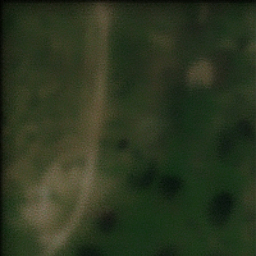

MEMNET

This repository is implementation of “MemNet: A Persistent Memory Network for Image Restoration" using TensorFlow.
This Model was trained on VOC2007 and VOC2012 dataset as the training data and can be downloaded from the internet. 

REQUIRED PACKAGES

Python 2.7
TensorFlow==1.4.0
OpenCV==2.4.9
Scikit-Image

QUICKSTART (DEMO)

You can test pretrained model MEMNET by placing the images in Set12 folder, the supported formats are png, jpeg files. For Pre trained models, Trained about 74000 steps, it can be downloaded with this link, https://drive.google.com/drive/folders/1JTneCiIZfITyg_Z2T96WY0hA84BnRDSk 

Run the Script in MemNet_N folder. By default test.sh is written for png files, to check for jpeg files , in test.sh change .png extension for testing_set variable to .jpeg. And run bash test.sh to test the images.
The output images can be found under results folder.

OUTPUT OF THE TRAINED MODEL 

ORIGINAL SATELLITE IMAGE 	LR IAMGE PATCH 	SUPER-RESOLUTED IMAGE	

 
 

